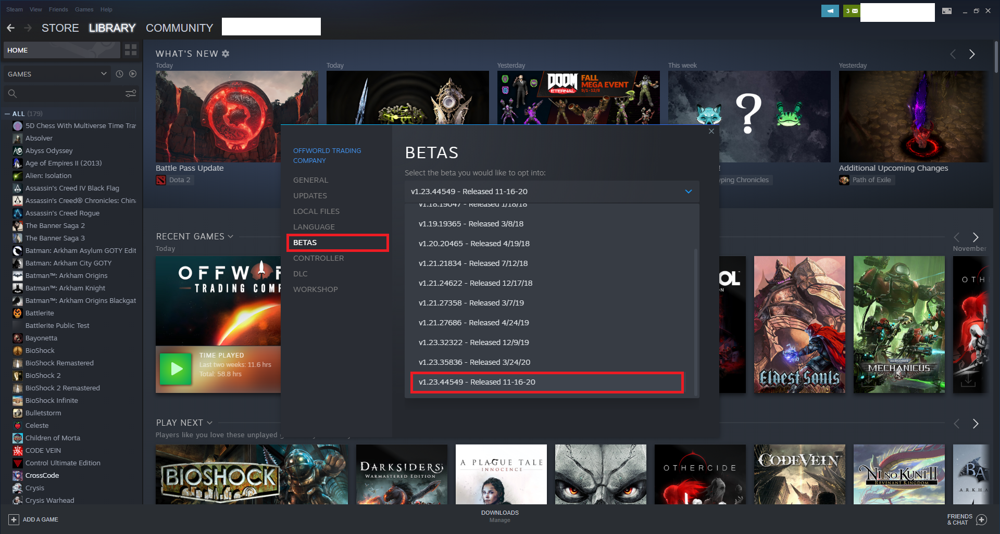
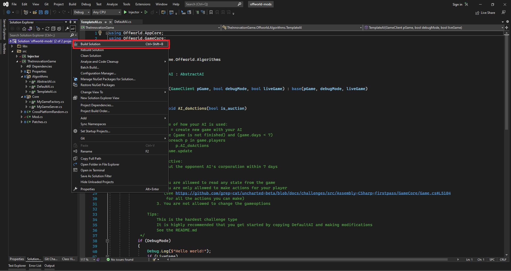
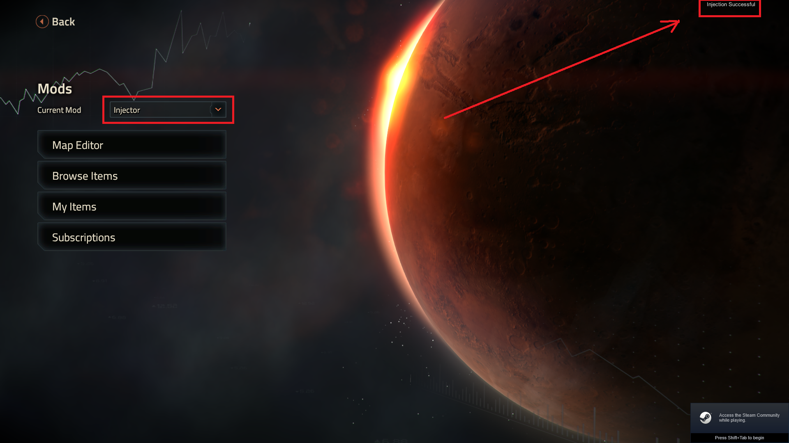
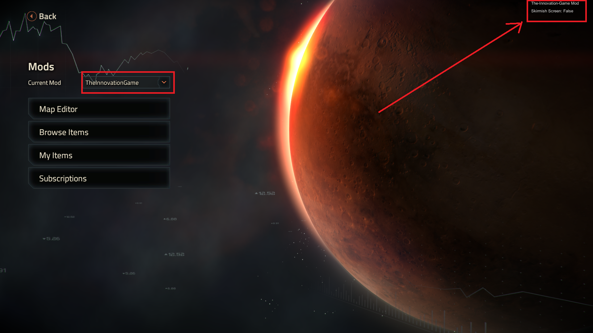
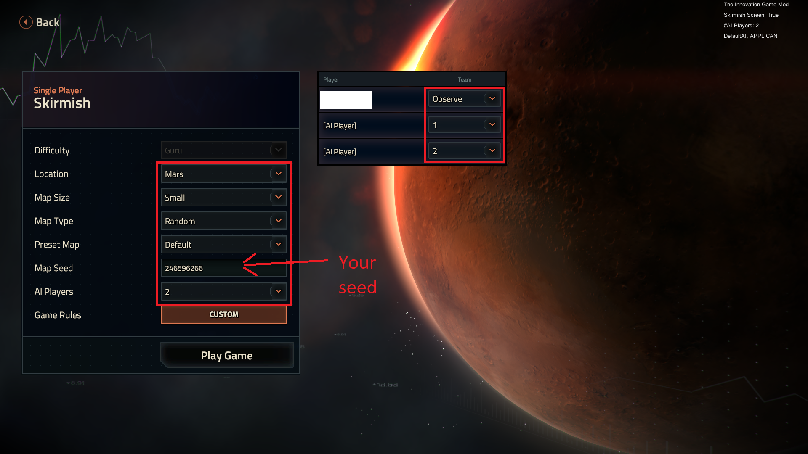
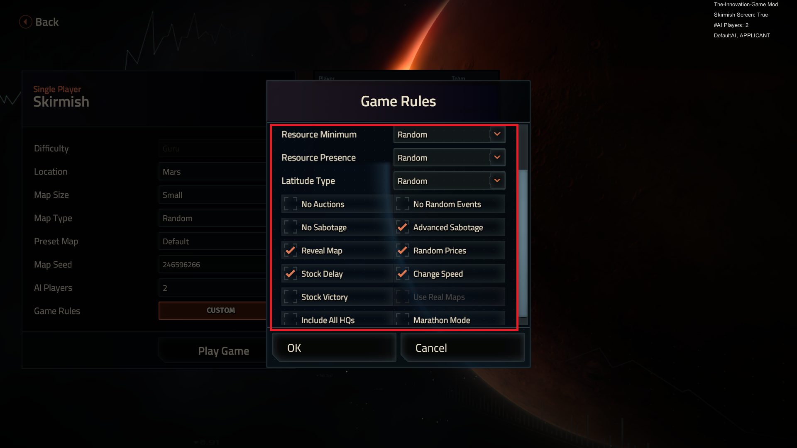
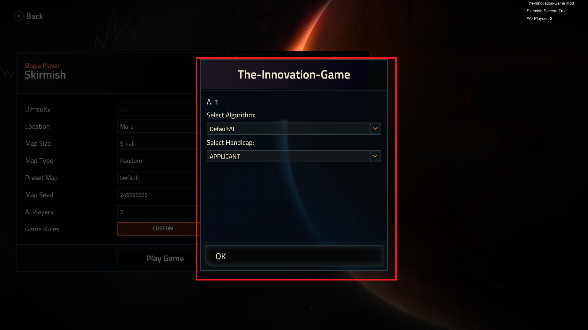
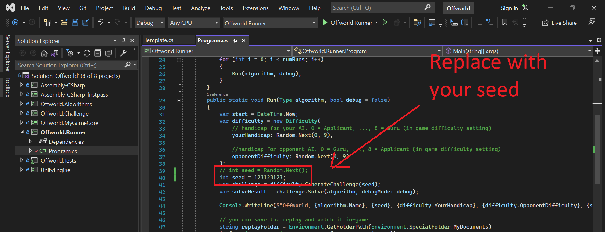
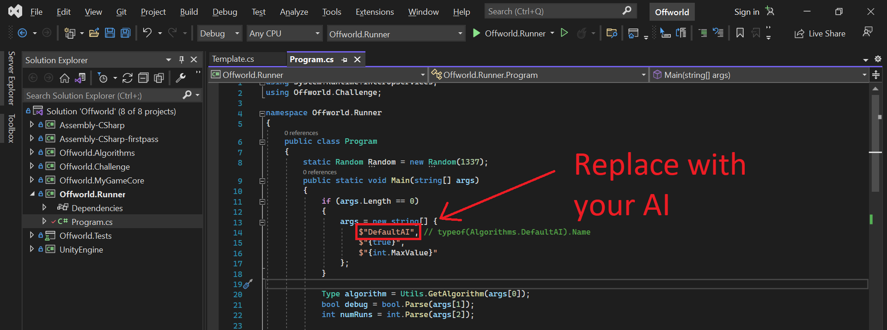

# The Innovation Game - Offworld Mods

This repo contains a visual studio solution for **Offworld Trading Company** Mods using AIs from **The Innovation Game**.

## Just want to play against better AIs?

If you simply want to play against the AIs from **The Innovation Game**, you can download the `offworld-mods.zip` file from our releases and follow the install instructions within. To load the mods, follow steps 5 & 6 from the next section. 

The mods are developed for **Offworld Trading Company** version `1.23.44549` from 16th Nov 2020. We do not gaurentee that they will work with the latest version of the game.

## Debugging your AI

1. To debug in-game, you have to have a [Steam copy of the game](https://store.steampowered.com/app/271240/Offworld_Trading_Company/)
   * A copy bought from Epic games will not support mods and versions

2. Once installed, change the version of the game to `1.23.44549` (right click -> properties)



3. Clone this repo and the [Offworld Challenges repo](https://github.com/the-innovation-game/offworld-challenge) such that they are local to each other:
    ```
    parent_folder
        |--- offworld-challenges
        |--- offworld-mods
    ```
4. Open `offworld-mods.sln` with Visual Studio 2022
   * You can directly code your AI algorithm in this solution. The algorithm folder is symbolic linked to the `offworld-challenge` source code

5. Building the solution should automatically copy the dlls to:
    * (Windows) `<Documents>\My Games\Offworld\Mods`
    * (Mac) `<Documents>\Library\Application Support\Offworld\Mods`



5. Start the game, and load the `Injector` mod. You should see a success message



6. You can then load the `TheInnovationGame` mod. You should see a success message
   * You must load the `Injector` mod first or else this step will not work



7. Create a skirmish and configure the game settings as follows:
   * The game speed can be anything
   * Pick any number for the `seed`, and take note of it





8. Press `Play Game` to start the skirmish. The mod will let you select the AI and handicap
   * Set `AI 1` to `DefaultAI`
   * Set `AI 2` to the AI you want to debug
   * You need to press `Play Game` again after choosing the AIs and difficulty



9. Open `Offworld.sln` from the Offworld Challenge repo and modify `Offworld.Runner/program.cs` as follows:
    * Use the same `seed` from step 7 
    

    * Use the same AI as `AI 2` from step 8
    

10. You can npw debug your AI in `Offworld.Runner` whilst watching it visually in-game. Note: Any debug logs your AI makes will be saved to:
    * (Windows) `<Documents>\My Games\Offworld\Logs\output.txt`
    * (Mac) `<Documents>\Library\Application Support\Offworld\Logs\output.txt`

## Support
[Join our Discord](https://discord.gg/SESJzxwY)

## License

TBC